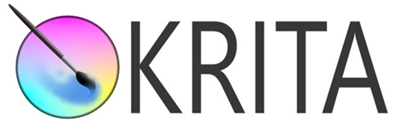

# 디자인

*이탤릭*
**볼드**

[네이버](http://www.naver.com/)

단순 소스 강조: `왓`

```HTML
<script>
	yes.$no = {
		feel: true
	}
</script>
```

*(띄어쓰기) 글	(항목 O 형성)
> 글 옆 바 생성
?> 배경 테마 색 (https://docsify.js.org/#/language-highlight)
!> 빨강 인포 (https://docsify.js.org/#/themes)


## [Krita](https://krita.org/ko/) **(무료)**
?> Krita는 무료의 전문적인 오픈 소스 페인팅 프로그램입니다. 이 프로그램은 누구나 좋은 툴을 얻을 수 있도록 하는 것을 원한 예술가들에 의해 만들어졌습니다.
